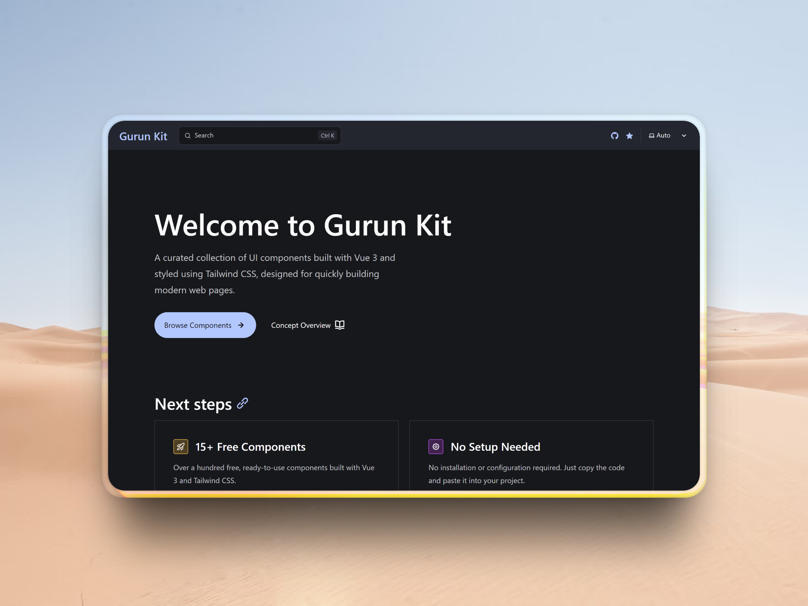

# Gurun Kit

A curated collection of UI components built with Vue 3 and styled using Tailwind CSS, designed for quickly building modern web pages.

[Read the documentation](https://gurunkit.teknogain.com)

